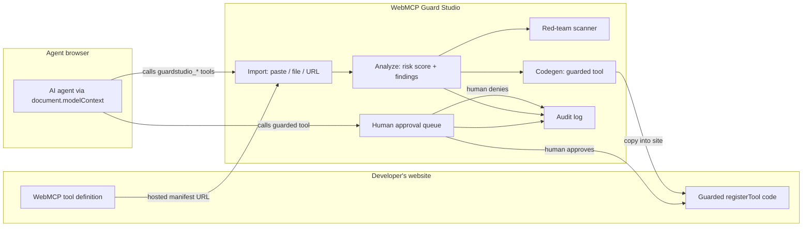

# WebMCP Guard Studio

WebMCP Guard Studio is a stateless developer tool for designing and hardening WebMCP tools before shipping them to agent-enabled browsers.

It combines:

- A Vercel-ready React frontend that registers its own WebMCP tools.
- A Render-ready FastAPI backend for static WebMCP policy checks.
- Optional Meta Prompt Guard model scanning through Hugging Face Transformers.
- A deterministic heuristic fallback so the live demo still works without model credentials.

## What It Demonstrates

The app helps a developer inspect any WebMCP tool definition, attach representative sample input and output payloads, classify risk, scan runtime data for prompt-injection patterns, generate guarded `document.modelContext.registerTool(...)` code, and simulate human approval gates with an audit log.

The WebMCP tools exposed by the frontend include:

- `guardstudio_import_tool_url`
- `guardstudio_analyze_tool`
- `guardstudio_scan_text`
- `guardstudio_generate_guarded_code`
- `guardstudio_simulate_call`

The included fixtures cover commerce, content, DevOps, and healthcare patterns. They are examples only; the main workflow is to import or paste a developer's own tool definition plus representative runtime input/output data.

## Importing Your Own Tool (No Copy/Paste Needed)

There are three ways to load a tool into the studio:

1. **JSON file** — click *Import → JSON file* in the side rail and pick a manifest from disk.
2. **URL** — paste an HTTPS URL to a hosted JSON manifest (a raw GitHub URL works) and click the import button. The backend fetches it with SSRF protection: HTTPS only, private/loopback hosts blocked, 300 KB size cap.
3. **Agent-driven** — an agent-enabled browser can call the `guardstudio_import_tool_url` WebMCP tool to import and then analyze a manifest without any human copy/paste.

### Manifest Shape

Host a JSON file in any of these shapes (all are accepted):

```json
{
  "tool": {
    "name": "update_inventory",
    "description": "Update product stock levels in the store catalog.",
    "inputSchema": {
      "type": "object",
      "required": ["sku", "quantity"],
      "properties": {
        "sku": { "type": "string", "maxLength": 40 },
        "quantity": { "type": "integer", "minimum": 0 }
      }
    }
  },
  "sample_input": { "sku": "SKU-1042", "quantity": 18 },
  "sample_output": { "sku": "SKU-1042", "status": "updated" }
}
```

Also accepted: a bare tool object (`{ "name": ..., "description": ..., "inputSchema": ... }`), `{ "toolDefinition": ... }`, or `{ "tools": [...] }` (the first tool is imported). `sampleInput`/`sampleOutput` camelCase keys work too. A ready-made example lives at [`examples/tool-manifest.json`](examples/tool-manifest.json).

Local development note: URL import requires HTTPS and blocks private hosts by default. To import from `http://localhost` during development, set `ALLOW_INSECURE_IMPORTS=true` and `ALLOW_PRIVATE_IMPORTS=true` on the backend.

## How It Integrates



## Repository Structure

```text
frontend/   Vite + React app for Vercel
backend/    FastAPI scanner service for Render
render.yaml Render blueprint for the backend
```

## Local Development

Run the backend:

```bash
cd backend
conda activate devpost-WebMCP-hackthon
uvicorn app.main:app --reload --port 8000
```

Run the frontend:

```bash
cd frontend
conda activate devpost-WebMCP-hackthon
npm run dev
```

Open the frontend at the Vite URL and set:

```bash
VITE_API_BASE_URL=http://localhost:8000
```

## Render Backend Deployment

Create a Render Web Service from this repo with:

- Root directory: `backend`
- Build command: `pip install -r requirements.txt`
- Start command: `uvicorn app.main:app --host 0.0.0.0 --port $PORT`

Environment variables:

```bash
CORS_ORIGINS=https://your-vercel-app.vercel.app
SCANNER_MODE=heuristic
PROMPT_GUARD_MODEL=meta-llama/Llama-Prompt-Guard-2-22M
HF_TOKEN=optional_huggingface_token
```

For live model scanning, set `SCANNER_MODE=model` and provide `HF_TOKEN` after accepting the Prompt Guard model terms. If the model cannot load, the backend falls back to a deterministic scanner and returns `backend: "heuristic"` in scan responses.

## Vercel Frontend Deployment

Create a Vercel project with:

- Root directory: `frontend`
- Build command: `npm run build`
- Output directory: `dist`

Environment variable:

```bash
VITE_API_BASE_URL=https://your-render-service.onrender.com
```

## Notes

This project is intentionally stateless. It does not use a database, accounts, or server-side persistence. Demo data and audit events live in browser state, while the backend treats every request independently.

## Generic Analysis Payload

`POST /scan/tool` accepts any tool plus runtime payloads:

```json
{
  "tool": {
    "name": "deploy_service",
    "description": "Deploy a selected service version to an environment.",
    "annotations": { "readOnlyHint": false },
    "inputSchema": {
      "type": "object",
      "additionalProperties": false,
      "required": ["environment"],
      "properties": {
        "environment": {
          "type": "string",
          "enum": ["staging", "production"]
        }
      }
    }
  },
  "sample_input": { "environment": "qa" },
  "sample_output": { "status": "prepared", "approvalRequired": true }
}
```
